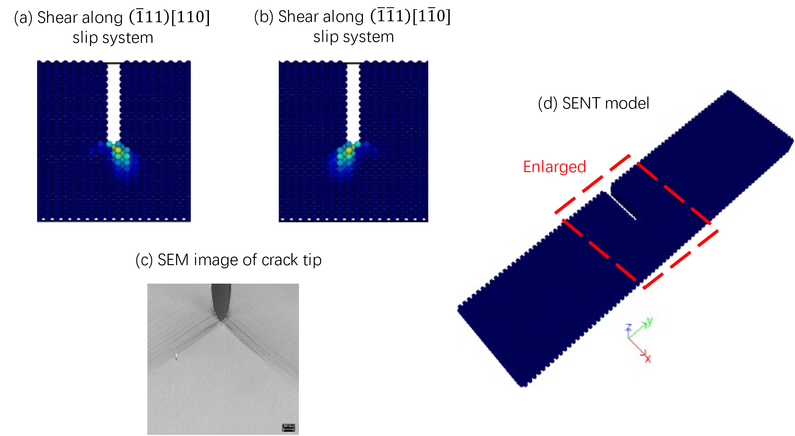

# LPM-C
A multi-threaded implementation of a nonlocal lattice particle method (LPM) using an iterative solution procedure. Below shows the image of slip system activation in a SENT sample [1].

## Prerequisites
- linux operating system (also work in Windows or other systems, but require different building procedures)
- C++ software development environment
- CMake version 13+

## Building instructions

### Intel MKL environment
1. go to Intel oneAPI website (https://www.intel.com/content/www/us/en/developer/tools/oneapi/overview.html) download and install the base and hpc toolkits (install 2021.4+ version to have a proper support for CMake)
2. source /your-oneapi-directory/setvars.sh linux64 --force
3. install Ninja: `sudo apt-get install ninja-build`
4. note: you may need to add the MKL include path into your editor preference

### Compile and run LPM-C
1. Clone the https://github.com/longfish/LPM-C.git into your own machine 
2. `mkdir build & cd build`
3. `cmake .. -G "Ninja" -DMKL_INTERFACE=lp64`
4. `cmake --build . -j 8`

### Run the code
`./lpmc`

The results will be in the build folder.

### Default numerical example
A 3D simple cubic lattice example under cyclic loading for isotropic hardening elastoplastic material is provided by default in `./src` directory.

### Examples
There are some example codes in the `./examples` folder that contains additional numerical cases in [1, 2]. They define the main() functions of the project. One should change the example file name to "lpmc_project.c" and replace it with the same file in `./src` directory then run the code (may need some modifications).

### References
1. Meng C, Wei H, Chen H, et al. Modeling plasticity of cubic crystals using a nonlocal lattice particle method[J]. Computer Methods in Applied Mechanics and Engineering, 2021, 385: 114069.

2. Meng C, Liu Y. Nonlocal Damage-enhanced Plasticity Model for Ductile Fracture Analysis Using a Lattice Particle Method[J]. arXiv preprint arXiv:2108.01214, 2021.
